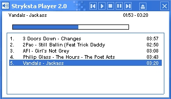



## Stryksta MP3 2\.0

### Description

Plays Mp3's, cda, and wav, and more if needed, just a simple player, nothing special. Custom Highlight in playlist, nice progress bar, drag and snap, and more. Can't remove from playlist yet, and there are a few bugs, i am working on them. I will update with better options and more functions. Note: Some of the Code is not mine, i apoligize, i forgot the authors names
 
### More Info
 

             |
---                |---
**Submitted On**   |2003-03-12 15:16:50
**By**             |[Stryksta Guy](https://github.com/Planet-Source-Code/PSCIndex/blob/master/ByAuthor/stryksta-guy.md)
**Level**          |Intermediate
**User Rating**    |4.3 (26 globes from 6 users)
**Compatibility**  |VB 5\.0, VB 6\.0
**Category**       |[Sound/MP3](https://github.com/Planet-Source-Code/PSCIndex/blob/master/ByCategory/sound-mp3__1-45.md)
**World**          |[Visual Basic](https://github.com/Planet-Source-Code/PSCIndex/blob/master/ByWorld/visual-basic.md)
**Archive File**   |[Stryksta\_M1558433122003\.zip](https://github.com/Planet-Source-Code/stryksta-guy-stryksta-mp3-2-0__1-43965/archive/master.zip)

